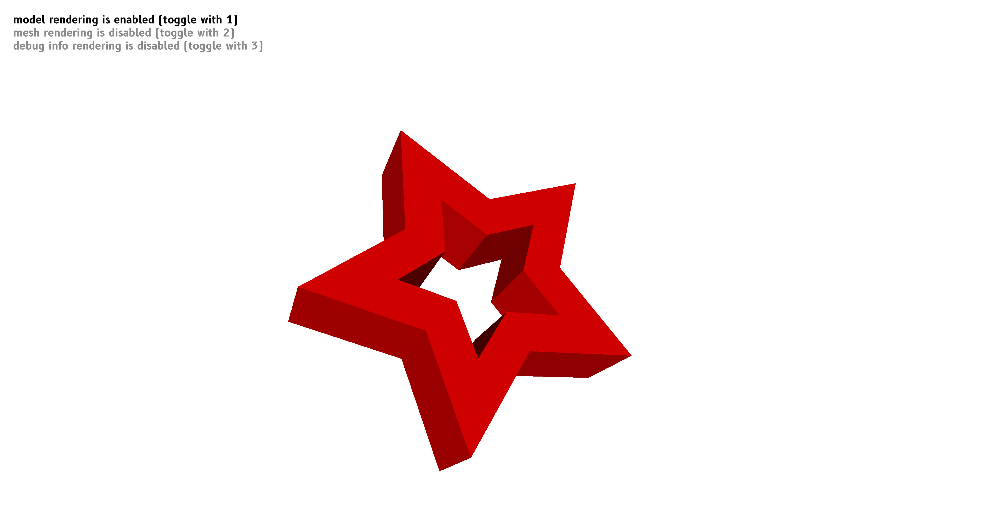

# Fornjot

[**Blog**](https://www.fornjot.app/blog/) | [**Matrix**](https://matrix.to/#/#fornjot:braun-odw.eu) | [**Discussions**](https://github.com/hannobraun/Fornjot/discussions) | [**Contribution Guide**](CONTRIBUTING.md)

## About

Fornjot is an **early-stage project** to create a **next-generation Code-CAD application**. Because [**the world needs another CAD program**](https://github.com/sponsors/hannobraun).



For an introduction of what the project aims to achieve, [please check out the website](https://www.fornjot.app/).


## Sponsors

Fornjot is supported by [**@webtrax-oz**](https://github.com/webtrax-oz), [**@lthiery**](https://github.com/lthiery), [**@Yatekii**](https://github.com/Yatekii), [**@martindederer**](https://github.com/martindederer), [**@ahdinosaur**](https://github.com/ahdinosaur), [**@jessebraham**](https://github.com/jessebraham), [**@Kethku**](https://github.com/Kethku), [**@sanxiyn**](https://github.com/sanxiyn), and my other awesome sponsors. Thank you!

**Please consider [supporting me too](https://github.com/sponsors/hannobraun), to help make Fornjot sustainable long-term.**


## Status

Fornjot is **under active development, but still experimental**. Efforts are currently focused on providing a [stable set of basic CAD features](https://github.com/hannobraun/Fornjot/milestone/1).

If you are interested in Fornjot and are considering to use it, you should fully expect to run into limitation pretty much immediately. Unless you are willing to contribute to its development, it would be better to wait for a year or ten, to let it mature. For more information on current limitations and improvements that could be implemented in the near future, [check out the open issues](https://github.com/hannobraun/Fornjot/issues).

To learn what the direction is longer-term, refer to the [feature wishlist](https://github.com/hannobraun/Fornjot/discussions/146).


## Features

### Code-CAD in Rust

Models are defined as Rust code. To ensure fast compile times, they are compiled separately, and loaded into a host application as a plug-in.

``` rust
use std::collections::HashMap;

#[no_mangle]
pub extern "C" fn model(args: &HashMap<String, String>) -> fj::Shape {
    let outer = args
        .get("outer")
        .unwrap_or(&"1.0".to_owned())
        .parse()
        .unwrap();
    let inner = args
        .get("inner")
        .unwrap_or(&"0.5".to_owned())
        .parse()
        .unwrap();
    let height = args
        .get("height")
        .unwrap_or(&"1.0".to_owned())
        .parse()
        .unwrap();

    let outer_edge = fj::Circle::from_radius(outer);
    let inner_edge = fj::Circle::from_radius(inner);

    let footprint = fj::Difference {
        a: outer_edge.into(),
        b: inner_edge.into(),
    };

    let spacer = fj::Sweep {
        shape: footprint.into(),
        length: height,
    };

    spacer.into()
}
```

This is the code for the [spacer model](/models/spacer). As you can see, there's still some work to do, to make the process of defining models more convenient.

### Basic modeling features

At this point, Fornjot supports basic 2D shapes (sketches made from lines segments, circles, limited combinations between them), sweeping those 2D shapes along a straight path to create a 3D shape, and some very incomplete support for constructive solid geometry (CSG).

The short- to mid-term priority is to provide solid CSG support, more flexible sketches, and more flexible sweeps (along a circle or helix). Long-term, the plan is to keep adding more advanced CAD modeling features, to support even complex models and workflows.

### Supports the major desktop platforms

As of this writing, Fornjot runs on Linux, Windows, and macOS. The project is primarily developed on Linux, so the other platforms might be subject to bugs. If you want to help out, regularly testing on Windows and macOS, and reporting bugs, is a good way to do so.

Short- to mid-term, the plan is to add support for the web platform, so Fornjot can run in browsers. Long-term, the plan is to additionally support the major mobile platforms.

### Export to 3MF

Exporting models to the [3D Manufacturing Format](https://en.wikipedia.org/wiki/3D_Manufacturing_Format) (3MF), which is used in 3D printing, is supported.


## Usage

### Defining models

Models depend on the [`fj`](/fj) library, which they use to define the geometry. Furthermore, they need to be built as a dynamic library. Just use the examples in the [`models/`](/models) directory as a template.

### Viewing models

To compile and view a model, run it from the host application.

``` sh
# Compile/view the spacer model
cargo run -- -m spacer
```

This invocation expects that the model exists in the `models/spacer` directory, with a package name of `spacer`.

Rotate the model by pressing the left mouse button while moving the mouse. Move the model by pressing the right mouse button while moving the mouse. Zoom with the mouse wheel.

Toggle model rendering by pressing `1`. Toggle mesh rendering by pressing `2`.

So far, the host application is not published on [crates.io](https://crates.io/), and the whole process is not really optimized for being used outside of this repository. Contributions to improve that situations are very welcome.

### Exporting models

To export a model to a 3MF file, run:

``` sh
cargo run -- -m spacer --export spacer.3mf
```

### Model parameters

Some models have parameters that can be overridden. For example, to override the inner and outer radii of the spacer model:

``` sh
cargo run -- -m spacer --parameters outer=8.0 --parameters inner=5.0
```


## Community

If you are interested in Fornjot, please consider joining the community. We'd love to have you!

### Questions, Feedback, Discussions

The following venues are best-suited for questions, feedback, or general discussions:

- [Matrix channel](https://matrix.to/#/#fornjot:braun-odw.eu)
- [GitHub Discussions](https://github.com/hannobraun/Fornjot/discussions)

### Bugs, Feature Requests

If you found a bug or have a specific feature request, please use issues on GitHub:

- [List of open issues](https://github.com/hannobraun/Fornjot/issues)
- [Open a new issue](https://github.com/hannobraun/Fornjot/issues/new)

Feel free to check existing issues and add your voice there, if you find one that fits. But if you are unsure or don't have the time for that, don't let that stop you. We'd rather have duplicate issues than not hear about a bug at all.


## Get Involved

If you are interested in helping out, just fork one of the GitHub repositories and submit a pull request:

- [Main Fornjot repository](https://github.com/hannobraun/Fornjot)
- [Website repository](https://github.com/hannobraun/www.fornjot.app)

If you don't know what to work on, check out the [`good first issues`](https://github.com/hannobraun/Fornjot/issues?q=is%3Aissue+is%3Aopen+label%3A%22good+first+issue%22). To get an overview over current priorities, take a look at the [open milestones](https://github.com/hannobraun/Fornjot/milestones).

If you need some more guidance, check out the [contribution guide](CONTRIBUTING.md), or just ask! See the Community section above, for how to get in touch.


## License

This project is open source, licensed under the terms of the [Zero Clause BSD License] (0BSD, for short). This basically means you can do anything with it, without any restrictions, but you can't hold the authors liable for problems.

See [LICENSE.md] for full details.

[`fj`]: https://crates.io/crates/fj
[Zero Clause BSD License]: https://opensource.org/licenses/0BSD
[LICENSE.md]: LICENSE.md
