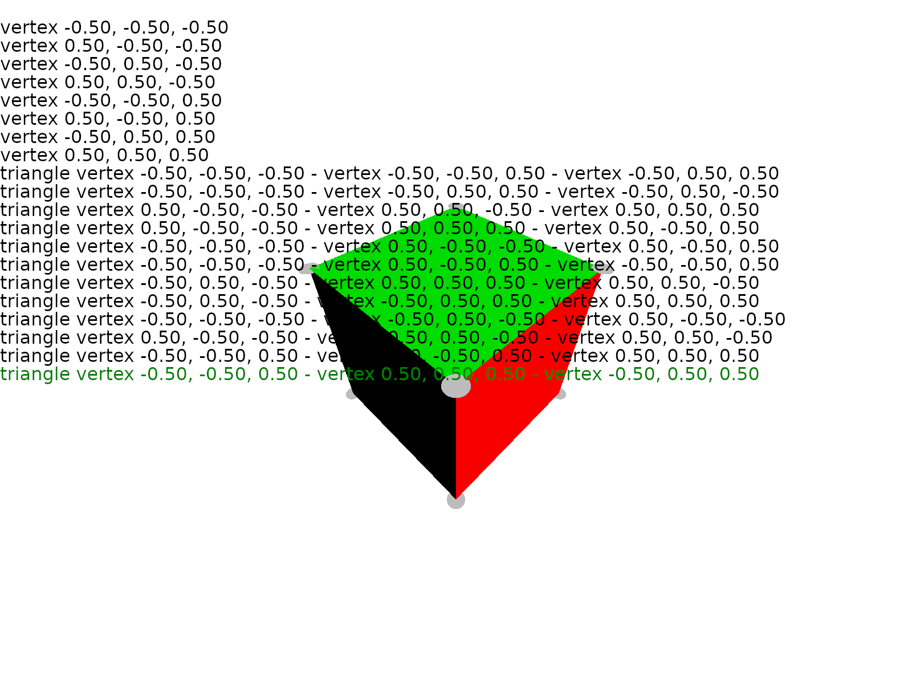

# Fornjot - Experiment 2024-10-30

## About

This experiment is packaged as a single application. Run it with `cargo run`.
This should open a window and also create a 3MF file in this directory.

Once you started the prototype, you should see the hardcoded geometry in a
background, and a list with operations in front. You can select other operations
using the "up" and "down" cursor keys, which should display the geometry as of
this operation.

## Context

It has become clear, that Fornjot's current architecture is at a local maximum.
I also think it is too complicated for what it does, and suspect that a simpler
architecture would serve us much better going forward.

While it's certainly not impossible to address this piecemeal, through
incremental improvements (which is the approach that I usually prefer), I don't
think this is the best course of action.

Because while I don't consider the architecture to be very good, it is still
consistent and self-reinforcing. Whenever I try to simplify one aspect, I run
into the problem that it's there for a reason; that other aspects of the
architecture depend on it being the way it is.

And while I haven't figured out yet, how to break out of this situation, I do
have quite a few unproven ideas on how an improved architecture would look like,
redesigned from the ground up using the experience I've gained over the last few
years.

This experiment is intended to be the first in a series, meant to prove out
those ideas. The results should provide a clearer picture of what is possible,
and how the current architecture can be evolved.

## Setup

I believe that one of the core mistakes that I made in designing Fornjot, was to
design it as a batch system. API calls come in on one side, geometry comes out
the other. What happens in between is not quite a black box, but it's not very
transparent either. This is a big pain, whenever something goes wrong.

To kick off the upcoming phase of experimentation, I wanted to figure out what
an interactive core could look like. One that allows you to see every single
step taken to build up the final result.

I wanted to do this based on a very simple geometry representation, a triangle
mesh, but with a view to later (in a follow-up experiment) expand that with a
layer of topological information.

## Result

I am generally quite happy with the result, although the experiment took longer
than I wanted it to.

It wasn't clear that adapting the existing renderer to the needs of this
prototype would be economical (I spent some time working on that, which made me
think it wasn't), so I decided to write a new one. Most of the work went into
that. I'm going to reuse it for follow-up experiments, and if this approach
works out, I hope I can merge any improvements into the existing renderer.

Relative to that, very little work went into the interactive core. I came up
with a design that I liked relatively quickly, so that was that. I'm not going
to describe the results here, as I have documented the code instead.

If you're interested in details, take a look at the code itself, or check out
the documentation (run `cargo doc --open` in this directory).
