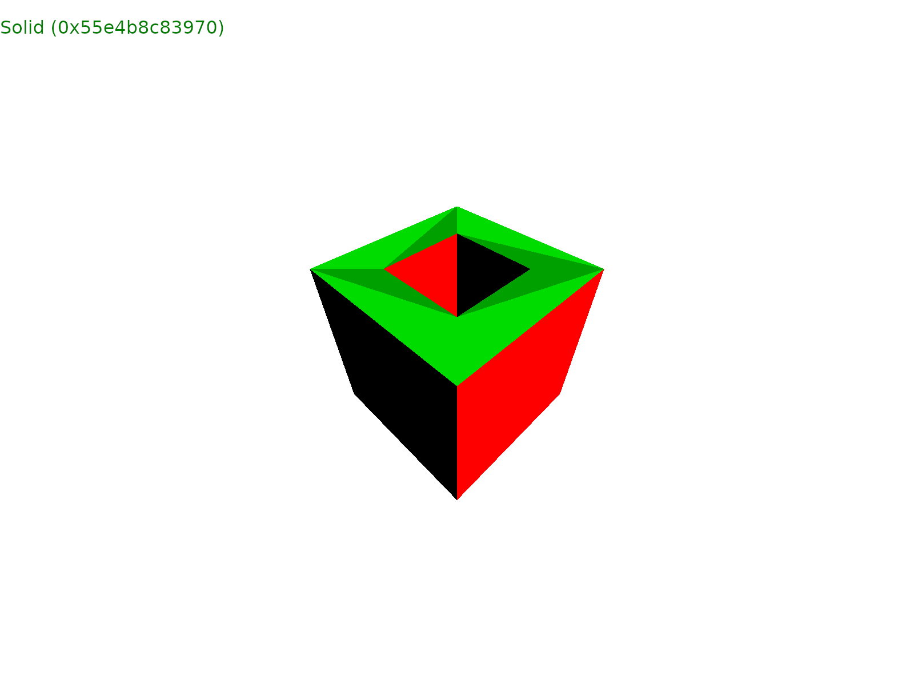

# Fornjot - Experiment 2024-12-09

## About

This experiment is packaged as a single application. Run it with `cargo run`.
This should open a window and also create a 3MF file in this directory.

Once you started the prototype, you should see the hardcoded geometry in the
center and a tree view of the geometry in the upper-left. You can expand tree
nodes with the "right" cursor key, navigate through the list of nodes with "up"
and "down", and close an expanded node with "left".

## Context

It has become clear, that Fornjot's current architecture is at a local maximum.
I also think it is too complicated for what it does, and suspect that a simpler
architecture would serve us much better going forward.

While it's certainly not impossible to address this piecemeal, through
incremental improvements (which is the approach that I usually prefer), I don't
think this is the best course of action.

Because while I don't consider the architecture to be very good, it is still
consistent and self-reinforcing. Whenever I try to simplify one aspect, I run
into the problem that it's there for a reason; that other aspects of the
architecture depend on it being the way it is.

And while I haven't figured out yet, how to break out of this situation, I do
have quite a few unproven ideas on how an improved architecture would look like,
redesigned from the ground up using the experience I've gained over the last few
years.

This experiment is the second in a series, meant to prove out those ideas. The
results should provide a clearer picture of what is possible, and how the
current architecture can be evolved.

## Setup

This experiment builds on [the first one](../2024-10-30/), expanding its simple
geometry with topological boundary representation (b-rep) primitives. This
brings it closer to the architecture of the current mainline code (although
remaining much simpler, and not that much more limited), positioning it as much
more of a real alternative.

A second objective was to build on top of the first experiment's simple
interactive system, enriching it with topological information. I was envisioning
this as a UI that can show both the structure of a shape (the elements it
consists of), but also the graph of operations that constructed it.

## Result

The results of this experiment have been mixed, being split between its two
objectives.

I am very happy with how the topological b-rep structure turned out. It has
stayed much simpler than the mainline architecture which has caused so much
trouble, while being only marginally less powerful. More so, it seems on track
to surpass the capabilities of the mainline architecture.

While this has been a full success, which I hope to build on further in coming
experiments, expanding on the interactive core from the first prototype has not
been.

In the end, I couldn't come up with an approach that met my goals. What I ended
up with, is a half-assed tree view that shows the structure of a shape, but
doesn't encode any of the operations that created it. I've come to believe that
the problem I was trying to solve was ill-defined in the first place.

While I'm sure that it's possible to come up with a better approach, I'm
actually trying to sidestep the whole thing: In one of the next experiments, I'd
like to experiment with approaches that provide full control to the user of the
API over what is displayed and where.

While this might not be as great as a more integrated approach could be, I do
think it will solve the practical problem of debugging Fornjot and code built on
top of it, while being much leaner, and thus easier to build. Maybe a more
ambitious visualization can be built on top of the Fornjot API in the future.

If you're interested in details, take a look at the code itself, or check out
the documentation (run `cargo doc --open` in this directory).

_Note: My writing process for the documentation in the code was a bit light on
proofreading (which probably reduced the total effort to a fraction of what it
would have been). I'm not sure how many people are actually interested in seeing
all of the details, so I was more interested in putting down the information and
moving on the next experiment._
