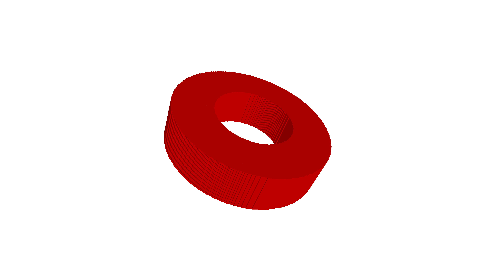

# Fornjot - Spacer

A simple spacer model that demonstrates the circle primitive, the difference operation, and sweeping that into a 3-dimensional shape.

To display this model, run the following from the repository root (model parameters are optional):
``` sh
cargo run -- spacer --parameters outer=1.0,inner=0.5,height=1.0
```


