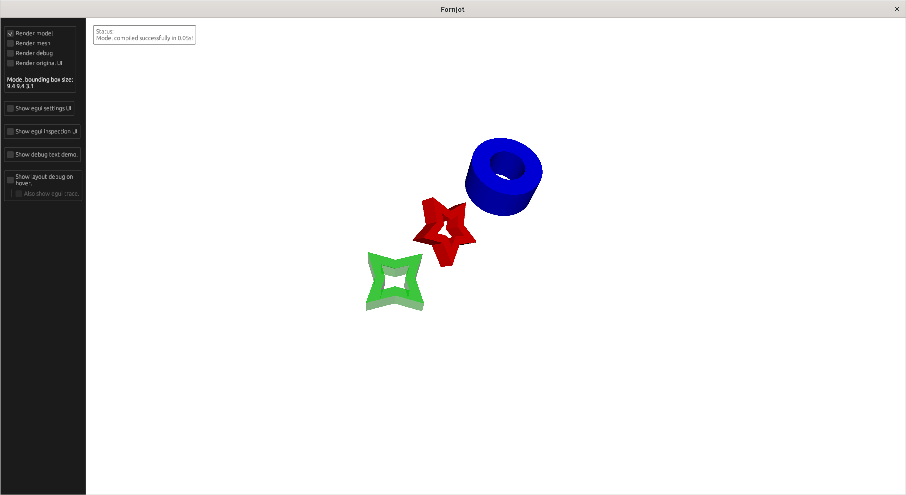

# Fornjot - Test Model

A model that tries to use all of Fornjot's features, to serve as a testing ground.

To display this model, run the following from the repository root:
``` sh
cargo run -- test
```


