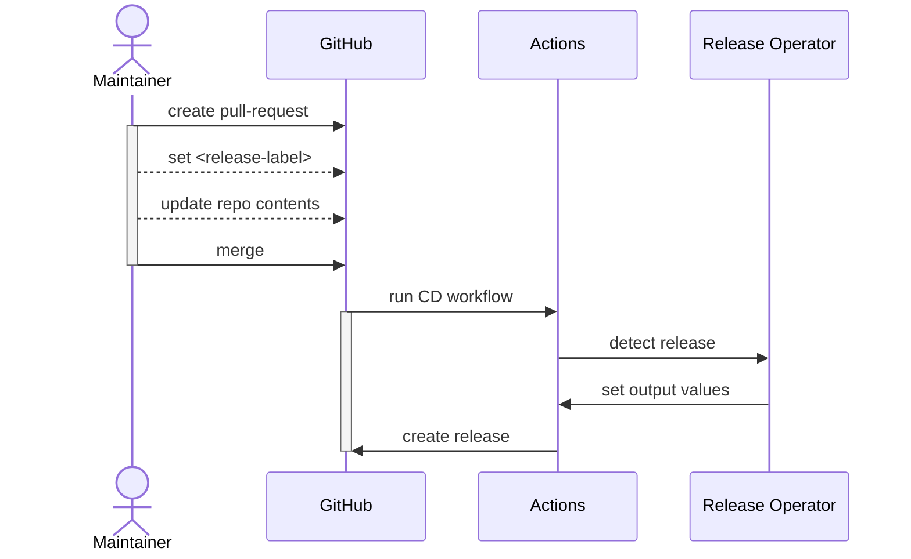

# Release Operator

Detect when a release pull-request is merged.

## Dependencies

- [`gh`](https://github.com/cli/cli) and a `GITHUB_TOKEN`[^1]
- [`git`](https://git-scm.org)
- GitHub Actions [^2]

[^1]: In GitHub Actions, `gh` is present and the default `GITHUB_TOKEN` fulfills all requirements to access Fornjot's repository
[^2]: The release operator is tailored to run within the context of GitHub Actions. While it can be executed locally, it wouldn't have any effects.

## Process Overview

A high-level overview of the process and the role of the release-operator.



_The "Actions" participant does a lot more which has been left out for the sake of simplicity. See the [release process] for all details._

[release process]: ../RELEASES.md

## Usage

```shell
# release-operator/
cargo run -- --sha <commit-sha> --label <release-label>
```

Where `<commit-sha>` can be set using `GITHUB_SHA` (present by default in GitHub Actions), and `<release-label>` can be set using `RELEASE_LABEL` (defaults to `autorelease`).

## Logging

The log level is set on the environment using `RUST_LOG` _(see [docs.rs/env_logger])

- The default log-level is set to `info` and yields the minimum amount of messages
- Use the `debug` level to see the reasons for the tools decisions
- Use the `trace` level to see details about every API call in the background
  - You will also see how long the program took to execute

[docs.rs/env_logger]: https://docs.rs/env_logger/latest/env_logger/#enabling-logging

## Related Issues & Resources

- https://github.com/hannobraun/Fornjot/issues/104
- [Case Study](https://github.com/hendrikmaus/rust-pr-based-release-workflow)
