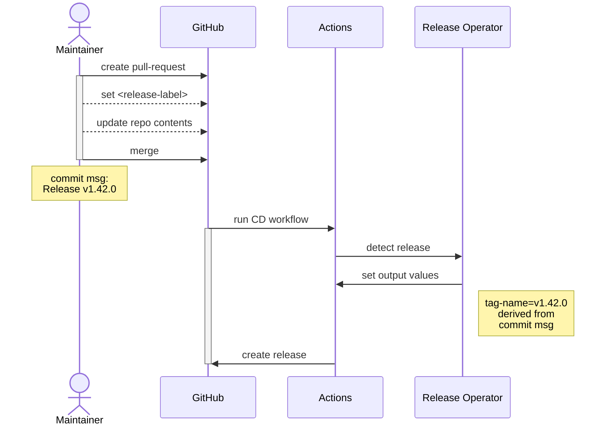

# Release Operator

Detect when a release pull-request is merged.

## Dependencies

- [`gh`](https://github.com/cli/cli) and a `GITHUB_TOKEN`[^1]
- [`git`](https://git-scm.org)
- GitHub Actions [^2]

[^1]: In GitHub Actions, `gh` is present and the default `GITHUB_TOKEN` fulfills all requirements to access Fornjot's repository
[^2]: The release operator is tailored to run within the context of GitHub Actions. While it can be executed locally, it wouldn't have any effects.

## Process Overview

A high-level overview of the process and the role of the release-operator.

<!-- The following is a mermaid sequence diagram https://mermaid-js.github.io/mermaid/#/sequenceDiagram -->



_The "Actions" participant does a lot more which has been left out for the sake of simplicity. See the [release process] for all details._

As seen above, the release operator requires the maintainer to:

- label the release pull-request with `<release-label>` (value decided upon later)
- include the semver version to release in the first line of the merge commit message

[release process]: ../RELEASES.md

## Usage

### Detect a Release

```shell
# tools/release-operator/
cargo run -- detect --sha <commit-sha> --label <release-label>
```

Where `<commit-sha>` can be set using `GITHUB_SHA` (present by default in GitHub Actions), and `<release-label>` can be set using `RELEASE_LABEL` (defaults to `autorelease`).

#### GitHub Actions

To embed the operator in a workflow, include these steps _before_ anything related to the project's source code:

```yaml
# Checkout the source code, this is done first in any case.
- uses: actions/checkout@v3

# Set up the rust toolchain.
# The operator uses the same toolchain as the project,
# hence this doesn't need to be done again later.
- uses: actions-rs/toolchain@v1
  with:
    toolchain: stable
    override: true
    profile: minimal

# Restore the cache of the release operator.
# The cache is kept separate from the project's cache using a dedicated cache key.
# Also mind the working directory.
- uses: Swatinem/rust-cache@v1
  with:
    key: release-rs-01
    working-directory: ./release-rs

# Run the release operator on `GITHUB_SHA` (set by Actions).
# Pass along `GITHUB_TOKEN` for the usage of `gh`, as well as the release label to look for.
# Please mind the working directory.
- id: release
  working-directory: release-rs
  env:
    GITHUB_TOKEN: ${{ secrets.GITHUB_TOKEN }}
    RELEASE_LABEL: autorelease
  run: |
    # release operator
    cargo run -- detect

# Subsequent steps can use:
#   if: ${{ steps.release.outputs.release-detected == 'true' }}
# to determine if they shall execute.
```

#### Outputs

The release operator defines "outputs" which can be read by subsequent steps within a GitHub Actions workflow:

- `release-detected` (string `"true"|"false"`) this output is always set to indicate if a release was detected or not
- `tag-name` (string) set to the tag name, if a release was detected

### Publish a List of Crates

```shell
# tools/release-operator/
cargo run -- publish \
  --token <crates.io-token> \
  --crate ../fj \
  --crate ../fj-host
```

The `--token` can also be set using on the environment using `CARGO_REGISTRY_TOKEN`.

The `--crate` option should be repeated for every crate to publish. Since the example is called from the `release-operator` subdirectory, all paths are relative to that location. The order matters; the crates are published top to bottom.

There is an option `--dry-run` flag, which defaults to `false`. Set it to run the entire process without uploading any artifacts.

## Logging

The log level is set on the environment using `RUST_LOG` _(see [docs.rs/env_logger])

- The default log-level is set to `info` and yields the minimum amount of messages
- Use the `debug` level to see the reasons for the tools decisions
- Use the `trace` level to see details about every API call in the background
  - You will also see how long the program took to execute

[docs.rs/env_logger]: https://docs.rs/env_logger/latest/env_logger/#enabling-logging

## Related Issues & Resources

- https://github.com/hannobraun/Fornjot/issues/104
- [Case Study](https://github.com/hendrikmaus/rust-pr-based-release-workflow)
